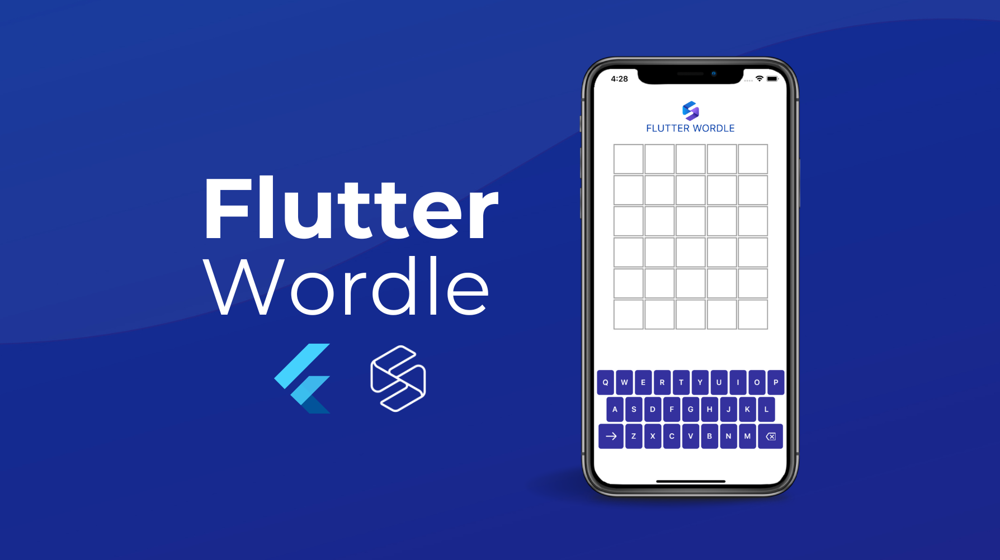

# Flutter Wordle💙 

[][somnio_software_link]

##### Flutter Wordle Challenge for Flutter Vikings 2022 💙  powered by [Somnio Software][somnio_software_link]

[![License: MIT][license_badge]][license_link]

---

## Let's play 🚀

We've all played Wordle, a game where we have to match new words every day! But, what about building one using Flutter? 

Let's create a Wordle with Flutter that only contains words related to Flutter! For example, Container, GestureDetector, Bloc, etc. It will be fun to create a game that involves our love for Flutter 💙. 

This Wordle, however, lets anyone play it as many times as they want! You’ll be able to play as much as you want! 

Also, who doesn’t love our cute little Dash? Wouldn't it be great if players could earn Dash points with every Wordle they solved?

Can’t wait to see what you create!

## Ingredients 🍳

-   Start with this template
-   Use only Flutter related words - the more the better!
-   Have fun with your creativity!

## Judging Criteria 🌟

-   Creativity
-   Code Quality (Just think that you are going to make this production LIVE)
-   Words related to Flutter used in Wordle
-   Extra features such as animations 
-   Scaling properly based on screen sizes (Ran on multiplatform would be a plus point)

## Submission Guidelines ✅ 

- When you have finished, submit the GitHub Link in [this form][google_form_link]
- Dates of submission: from 8/29/22 till 9/12/22
- It should also include an output video
- If you have run it on the web, add the link to the website after deploying.

## Prize 🏆
The winner gets [Codemagic][codemagic_link] Annual Professional Plan! 

[somnio_software_link]: https://somniosoftware.com/
[google_form_link]: https://docs.google.com/forms/d/e/1FAIpQLSeC-hObXrRAnGu7OoDZyoomdYSdkJ28hUoi1RHzWI8gaFLdig/viewform?vc=0&c=0&w=1&flr=0
[codemagic_link]: https://codemagic.io/
[license_badge]: https://img.shields.io/badge/license-MIT-blue.svg
[license_link]: https://opensource.org/licenses/MIT
